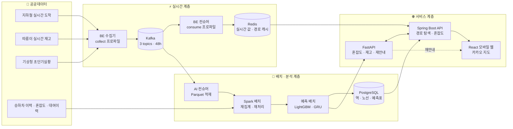

<div align="center">

# 🚇 숨길 · SUMGIL

### 붐비는 지하철 대신, 덜 붐비는 길을 숫자로 고른다

서울시 공공데이터를 **Kafka · Spark**로 수집·분산 처리하고, 혼잡도와 따릉이 재고를 **예측**해<br/>
지하철 · 버스 · 따릉이를 엮은 **"빠른 길"과 "덜 붐비는 길"** 을 함께 안내하는 모바일 웹 내비게이션

<br/>


<br/>


<br/>

**빅데이터 분산처리** &nbsp;|&nbsp; 2026.08 – 2026.10

[🌐 서비스](https://j15a104.p.ssafy.io) · [📋 JIRA](https://ssafy.atlassian.net/jira/software/c/projects/S15P21A104/boards/15001) · [🦊 GitLab](https://lab.ssafy.com/s15-bigdata-dist-sub1/S15P21A104)

</div>

---

## 📑 목차

1. [프로젝트 소개](#-프로젝트-소개)
2. [기획 배경 — 문제 상황](#-기획-배경--문제-상황)
3. [주요 기능](#-주요-기능)
4. [시스템 아키텍처](#-시스템-아키텍처)
5. [기술적 배경](#-기술적-배경)
6. [기술 스택](#-기술-스택)
7. [폴더 구조](#-폴더-구조)
8. [시작하기](#-시작하기)
9. [문서](#-문서)

---

## 💡 프로젝트 소개

> **"계속 탈까, 내려서 따릉이 탈까?"**<br/>
> 출근길 만원 지하철에서 누구나 한 번쯤 하는 고민을 **감이 아니라 숫자로** 판단하게 해 주는 서비스입니다.

**숨길**은 출발지와 도착지를 입력하면 지하철 · 버스 · 따릉이를 조합한 경로 후보를 찾아 주고, 각 구간이 **얼마나 붐빌지**와 **도착했을 때 따릉이가 남아 있을지**를 함께 보여 줍니다. 이동 중 따릉이 재고가 바닥나는 등 상황이 바뀌면 **재안내 에이전트**가 대안을 제시합니다.

| | |
| :-- | :-- |
| 🎯 **목표** | 최단 시간뿐 아니라 **쾌적함**까지 고려한 경로 선택 |
| 📊 **데이터** | 서울 열린데이터광장 · 공공데이터포털 · 기상청 등 **무료 공공데이터** |
| ⚙️ **핵심 기술** | Kafka 실시간 수집 · Spark 분산 집계 · LightGBM/GRU 혼잡도 예측 · 다익스트라 경로 탐색 · LLM 재안내 |
| 📱 **형태** | 모바일 웹 (카카오 지도 기반) |

---

## 🔥 기획 배경 — 문제 상황

### 1. 지도 앱은 "가장 빠른 길"만 알려 준다

기존 길찾기 서비스는 **소요 시간**을 기준으로 경로를 정렬합니다. 하지만 출퇴근 시간대 2호선처럼 정원을 훌쩍 넘겨 붐비는 구간에서는, 몇 분 늦더라도 덜 붐비는 길을 원하는 사용자가 많습니다. **혼잡도는 경로 선택의 기준이 되지 못하고 있습니다.**

### 2. 공개된 혼잡도 데이터는 "평균"뿐이다

서울시가 공개하는 지하철 혼잡도는 **분기마다 갱신되는 대표 1주 평균**이고, **1~8호선만** 제공됩니다. 날짜 컬럼이 없어 특정 날짜 · 공휴일 · 행사일의 혼잡을 반영하지 못합니다. 그대로 쓰면 "오늘"의 혼잡도가 아니라 "언젠가의 평균"을 보여 주게 됩니다.

### 3. 따릉이로 갈아타면 더 빠른 "역전 구간"이 있지만, 아무도 계산해 주지 않는다

지하철 경로에는 **환승 도보 · 환승 대기**라는 숨은 비용이 있습니다. 이 비용 때문에 중간에 내려 따릉이를 타는 편이 더 빠른 구간이 실제로 존재합니다. 그러나 **도착했을 때 대여소에 자전거가 남아 있을지** 모르면 이 선택은 도박이 됩니다.

### 💭 그래서 우리는

| 문제 | 숨길의 접근 |
| :-- | :-- |
| 시간만 보는 경로 정렬 | **"빠른 길" / "덜 붐비는 길"** 두 기준으로 경로 후보를 함께 제시 |
| 평균뿐인 혼잡도 | 일별 승하차 이력 + 최근 실측(D−1)으로 **날짜별 혼잡도를 예측** |
| 불확실한 따릉이 재고 | 실시간 재고 스트림 + 과거 패턴으로 **도착 시점 재고를 예측**하고, 고갈 시 **재안내** |

> 📂 주제 확정까지 **14개 후보**와 **데이터·API 47건**을 검토한 과정은 [`Docs/Service Design/`](./Docs/Service%20Design/)에 기록돼 있습니다.

---

## ✨ 주요 기능

### 🔍 1. 장소 검색 & 경로 탐색

- 장소명 · 도로명 주소 검색(카카오 SDK), 지도에서 직접 위치 선택, 현재 위치 출발
- 좌표 기반 경로 탐색으로 **지하철 · 버스 · 따릉이를 조합한 최대 6개 후보** 제시
- 이동수단 필터(지하철 · 버스 · 따릉이 조합)로 후보 좁히기

### 🚦 2. "빠른 길" vs "덜 붐비는 길"

- **빠른 길** — 소요 시간 최단 경로 우선 (속도 우선 3개)
- **덜 붐비는 길** — 구간 혼잡도가 가장 낮은 경로 우선 (혼잡 회피 3개)
- 탭 하나로 정렬 기준 전환

### 🗺️ 3. 구간별 혼잡도 시각화

- 지하철 · 버스 구간을 **여유 / 보통 / 혼잡** 3단계 색상으로 지도 경로선에 표시
- 지하철은 **예측 혼잡도**, 버스는 **실시간 도착정보 기반 혼잡 등급** 사용
- 값을 낼 수 없는 구간은 0으로 채우지 않고 **"데이터 없음"을 명시**

### 🚲 4. 따릉이 재고 & 도착 시점 예측

- 경로상 대여소 위치와 **실시간 잔여 대수** 표시
- 과거 평균 패턴 + 실시간 재고로 **도착 시점의 예상 재고** 계산

### 🤖 5. 실시간 재안내 에이전트

- 길안내 중 이용 예정 대여소의 **재고 고갈 위험**을 감지하면 팝업으로 대안 제시
- 규칙 기반 트리거 → 인근 대여소 후보 수집 → **LLM 1회 호출**로 대안 선택 · 사유 문장 생성
- LLM 실패 시 **규칙 전략으로 자동 폴백** — 서비스는 끊기지 않습니다

### 🧭 6. 길안내 & 도착

- 다음 구간 · 환승 정보를 순서대로 안내하는 이동 화면
- 바텀시트 드래그 · 클릭 · 키보드 조작 지원

---

## 🏗 시스템 아키텍처



### 데이터 흐름 한눈에

| 흐름 | 경로 | 주기 |
| :-- | :-- | :-- |
| **실시간** | 공공 API → BE 수집기 → Kafka → BE 컨슈머 → Redis → API | 수 분 단위 폴링 |
| **분석용 적재** | Kafka → AI 컨슈머(별도 컨슈머 그룹) → Parquet(`dt=/hh=` 파티션) | 상시 |
| **예측 배치** | 최근 실측 수집(D−1) → 혼잡도 예측 → 예측표 → BE 적재 | 매일 (systemd timer) |
| **재집계** | 원천 로그 → Spark 잡 → 집계 테이블 | 배치 |

---

## 🧠 기술적 배경

### 1. 데이터 크기에 맞는 분산 처리

집계 데이터(혼잡도 · 승하차)는 작아서 그대로 씁니다. 분산은 **원본 로그 · 스트림 · 조합 폭발 계산**에서만 정당화된다는 전제를 세우고, 이를 **실측으로 검증**했습니다.

| 측정 | 결과 |
| :-- | :-- |
| pandas vs PySpark 비교 (실제 파이프라인 연산 3종) | 현재 규모(최대 1,620만 행)에서는 **pandas가 더 빠름** — 전환 임계는 약 2,000만~5,000만 행 |
| 메모리 | pandas는 **최대 51.8GB**까지 상승, Spark는 전 구간 **2.5~8.7GB로 평탄** |
| 운영 서버 실측 (승하차 재집계, 1,000일치 2,800만 행) | 드라이버 수집 제거 후 **RSS 3.9GB 평탄 · 완주**, pandas 결과와 **정확성 오차 0.0** |

> **"데이터가 작은 곳은 pandas, 메모리가 터지는 곳은 Spark"** — 도구 선택의 근거를 숫자로 남겼습니다.

### 2. 실시간 수집

- 서울 열린데이터광장은 **일일 호출 한도**가 있어, 여러 프로세스가 각자 폴링하면 관리가 불가능합니다.
- **수집기(`collect`) 한 곳만** 외부 API를 호출하고 Kafka에 발행합니다. **API 서버에는 Kafka 빈이 아예 없고** Redis를 읽기만 합니다 — 이 경계는 테스트(`KafkaBeansAbsentTest`)로 강제합니다.
- 같은 이벤트를 **BE(Redis 반영)와 AI(분석 적재)가 서로 다른 컨슈머 그룹**으로 독립 소비합니다.
- 컨슈머 lag · 파싱 실패 · 저장 실패를 상태 파일로 남기고, 지속 시 알림을 보내는 모니터링을 갖췄습니다.

### 3. 혼잡도 예측

```
예측 = lookup(요일유형 × 역 × 시간대 평균)  +  LightGBM 잔차(전날 · 같은 요일유형 직전 날 · 1주 전)
```

- 타깃: **1~8호선 273역 × 시간대별 승하차 인원** → 재귀식과 배율표로 30분 혼잡도(%)로 변환
- 시간 분할(2024 학습 / 2025 평가)로 누수 차단, 날짜 블록 부트스트랩 1,000회로 신뢰구간 산출

| 모델 | 기준선(lookup) 대비 RMSE 개선 (승차 / 하차) |
| :-- | :-- |
| 이벤트 피처만 | +1.5% / +1.5% |
| **배포 모델** (전날 + 같은 요일유형 직전 날 + 1주 전 잔차) | **+23.4% / +25.4%** <br/><sub>95% CI [+21.2, +25.4] / [+23.2, +27.4]</sub> |

- **최근 실측의 가용성에 따라 모델을 라우팅**합니다. 전날 실측만 있을 때는 GRU, 그 밖의 결측 시나리오는 학습 단계부터 결측을 본 **마스킹 LightGBM**을 씁니다.
- SARIMA · Chronos(시계열 파운데이션 모델) · 선형 모델과 비교 실험을 거쳐 LightGBM 잔차 구조를 확정했습니다.

### 4. 경로 탐색

- 역 · 정류장 · 대여소를 노드로 하는 그래프에서 **다익스트라**로 탐색합니다.
- **역전 구간**(지하철만 타는 것보다 따릉이로 갈아타는 쪽이 빠른 구간)을 별도 API로 판정하지 않고, 혼합 경로 탐색 결과에 자연스럽게 포함시켰습니다.
- 같은 구간 · 같은 시간대 검색 결과는 **Redis에 30분 TTL로 캐시**해 재계산을 줄입니다.

### 5. 재안내 에이전트
```
① 트리거(규칙) → ② 후보 수집 → ③ 프리페치(도구 호출) → ④ 선택(LLM) → ⑤ 사유 문장(LLM)
```

| | 단일 호출 (채택) | 상태 그래프 프레임워크 |
| :-- | :-- | :-- |
| LLM 턴 수 | **1턴** (2~4초) | 2~4턴 (5~15초) |
| 재현성 | 같은 입력 → 같은 프롬프트 | 턴마다 도구 선택이 달라짐 |
| 폴백 | 실패 지점 1곳 → 규칙 전략 | 노드별 폴백 필요 |

- 이동 중 팝업이라 **지연이 곧 무용**입니다. ①~③을 결정론으로 끝내고 LLM은 ④⑤에서만 동작합니다.
- 도구 계층은 **예산 · 레이트 제한 가드**로 폭주를 막고, 도구 계약 문서와 코드의 일치를 **테스트가 강제**합니다.

### 6. 데이터 원칙

데이터 검증 단계에서 도출한 **원칙 8가지**를 코드 전반에 적용했습니다.

- 🚫 **표본이 부족한 구간에 값을 채우지 않는다** — 결측은 0이 아니라 `data_status`로 응답
- 📉 **추정 데이터는 절대값이 아니라 변화율 · 상대 순위로 쓴다**
- 🔁 **모든 실험은 재현 가능하게** — 검증 코드는 `AI/validation/<도메인>/<주제>/`에 결과(`RESULTS.md`)와 함께 보관

### 7. 인프라

- **k3s** (control-plane 1 + worker 1) · **Kustomize** · **ingress-nginx** · 클러스터 내장 이미지 레지스트리
- 단일 도메인에서 경로로 라우팅: `/` → FE, `/api/` → BE
- 관리 평면(VPN)과 데이터 평면(VPC VXLAN)을 분리하고, 데이터 포트는 클러스터 내부(ClusterIP)에만 노출
- 운영 관측 1단계: 배치 잡 · 모델 품질 지표를 node-exporter textfile(`.prom`)로 내보내고, Grafana 대시보드 3종(파이프라인 상태 · 모델 품질 · Spark 잡)을 로컬 검증 환경에서 구성

---

## 🛠 기술 스택

| 영역 | 기술 |
| :-- | :-- |
| **Frontend** | React 19 · TypeScript · Vite · TailwindCSS 4 · Vitest · Kakao Maps JS SDK |
| **Backend** | Java 21 · Spring Boot 4.1 · Spring Data JPA · Spring Kafka · Flyway · springdoc-openapi |
| **AI / Data** | Python 3.11 · FastAPI · PySpark · pandas · LightGBM · PyTorch(GRU) · scikit-learn |
| **Streaming / Storage** | Apache Kafka · Redis · PostgreSQL · Parquet |
| **LLM** | OpenAI 호환 게이트웨이(GMS) — 재안내 사유 생성 |
| **Infra** | AWS EC2 × 2 · k3s · Kustomize · ingress-nginx · Docker · systemd timer |
| **Observability** | node-exporter textfile 지표 · Prometheus · Grafana (1단계 검증) |
| **Collaboration** | GitLab · JIRA · Notion · Discord |

---

## 📁 폴더 구조

```
SUMGIL/
├─ 🧠 AI/                    분석 파이프라인 · 모델 · AI 서빙 (Python)
│  ├─ app/                   FastAPI 서빙 — 도메인 우선 구조
│  │  ├─ CROWD/              혼잡도 예측 (pipeline/: 학습 · 배치 추론 · 라우팅)
│  │  ├─ BIKE/               따릉이 재고 · 도착 시점 재고 예측
│  │  ├─ ROUTE/              경로 관련 산출물
│  │  ├─ TIME/               실시간 재안내 에이전트 (트리거 · 도구 계층 · LLM)
│  │  └─ ops/                운영 지표 읽기 API
│  ├─ DATA_ENGINE/           수집 · 정규화 · 분산 처리
│  │  ├─ collect/            외부 API 배치 수집 (D−1 승하차 등)
│  │  ├─ stream/             Kafka 컨슈머 → Parquet 적재
│  │  ├─ spark/              Spark 공통 모듈 · 잡 (재집계 · 재처리 · 리플레이)
│  │  ├─ batch/              raw → interim 정규화
│  │  ├─ eda/                탐색 분석 · 보고서 그림
│  │  ├─ monitor/            수집 상태 · consumer lag 감시
│  │  └─ observability/      textfile 지표 내보내기
│  ├─ validation/            실험 · 검증 코드와 결과 (CROWD · BYC · TIME · INFRA)
│  └─ test/                  pytest (app/ 구조 미러)
│
├─ ☕ BE/                    API 서버 (Java · Spring Boot)
│  └─ src/main/java/com/ssafy/s15p21a104/
│     ├─ domain/             station · bus · bike · congestion · route(그래프 · 다익스트라)
│     ├─ collect/            실시간 수집기 (collect 프로파일 · 호출 예산 관리)
│     ├─ consume/            Kafka → Redis 반영 (consume 프로파일)
│     ├─ load/               정적 · 배치 데이터 적재
│     └─ global/             공통 응답 · 예외 · 캐시 · 설정
│
├─ ⚛️ FE/                    모바일 웹 클라이언트 (React · TypeScript)
│  └─ src/
│     ├─ pages/              홈 · 검색 · 결과 · 상세 · 길안내 · 도착
│     ├─ features/           route · map · guidance
│     └─ api/                API 계약 · 저장소 · mock
│
├─ 🐳 Infra/                 배포 구성
│  ├─ k8s/                   네임스페이스 · ingress-nginx · 데이터 계층(PG · Redis · Kafka) · 스크립트
│  └─ docker/                로컬 개발용 docker-compose
│
├─ 📦 exec/                  빌드 · 배포 매뉴얼 · 외부 서비스 정보 · 시연 시나리오
└─ 📚 Docs/
   ├─ Convention/            Git 컨벤션
   └─ Service Design/        기획 · 데이터 검증 리포트
```

---

## 🚀 시작하기

> 파트별 상세 셋업은 각 폴더의 README를 참고하세요. 운영 배포 절차는 [`exec/01_빌드_및_배포_매뉴얼.md`](./exec/01_빌드_및_배포_매뉴얼.md)에 있습니다.

```bash
# 1. 로컬 데이터 계층 (PostgreSQL · Redis · Kafka)
docker compose -f Infra/docker/docker-compose.yml up -d postgres redis
docker compose -f Infra/docker/docker-compose.yml up -d --wait kafka

# 2. Backend — http://localhost:8080
cd BE && SPRING_PROFILES_ACTIVE=local ./gradlew bootRun

# 3. AI 서빙 — http://localhost:8000
cd AI && pip install -r requirements-dev.txt
uvicorn app.main:app --port 8000

# 4. Frontend — http://localhost:5173
cd FE && npm ci && npm run dev
```

API 키(서울 열린데이터광장 · 공공데이터포털 · 기상청 · 카카오)는 각 파트의 `.env`에 두며 저장소에 포함하지 않습니다. 필요한 키 목록은 [`exec/02_외부_서비스_정보.md`](./exec/02_외부_서비스_정보.md)를 참고하세요.

---

## 📚 문서

| 파트 | 문서 |
| :-- | :-- |
| 🧠 AI & Data | [AI/README.md](./AI/README.md) · [DATA_ENGINE](./AI/DATA_ENGINE/README.md) · [혼잡도 서빙 계약](./AI/app/CROWD/SERVING_CONTRACT.md) · [모델 레지스트리](./AI/app/CROWD/pipeline/MODEL_REGISTRY.md) · [재안내 에이전트 설계](./AI/app/TIME/AGENT_DESIGN.md) |
| ☕ Backend | [BE/README.md](./BE/README.md) · [BE 문서 모음](./BE/docs/README.md) · [경로 API 명세](./BE/docs/api/route-api-spec.md) · [Kafka](./BE/docs/infra/kafka.md) |
| ⚛️ Frontend | [FE/README.md](./FE/README.md) · [FE 문서 모음](./FE/docs/README.md) |
| 🐳 Infra | [Infra/README.md](./Infra/README.md) · [클러스터 네트워크](./Infra/k8s/NETWORK.md) |
| 📦 제출 | [빌드 · 배포 매뉴얼](./exec/01_빌드_및_배포_매뉴얼.md) · [외부 서비스 정보](./exec/02_외부_서비스_정보.md) · [시연 시나리오](./exec/04_시연_시나리오.md) |

<details>
<summary><b>📝 기획 문서</b> — 주제 선정부터 데이터 검증까지</summary>

<br/>

| 문서 | 내용 |
| :-- | :-- |
| [주제 선정 및 데이터 검토 리포트](./Docs/Service%20Design/기획-데이터-검토-리포트.md) | 전체 흐름 · 선정 기준의 진화 · 의사결정 로그 |
| [주제 기준 기획](./Docs/Service%20Design/주제-기준-기획.md) | 주제를 먼저 정하고 데이터를 찾은 후보 3건 |
| [데이터 기준 기획](./Docs/Service%20Design/데이터-기준-기획.md) | 혼잡도 데이터에 주제를 붙인 후보 11건 |
| [데이터 검증 리포트](./Docs/Service%20Design/데이터-검증-리포트.md) | 데이터 · API 47건의 6축 검증과 판정, 원칙 8가지 |

</details>

<details>
<summary><b>🤝 개발 규칙</b> — 브랜치 · 커밋 · MR</summary>

<br/>

[Git Convention](./Docs/Convention/Git%20Convention.md)을 따릅니다.

```
브랜치   feat/{스토리 키}-{작업 내용}     예) feat/S15P21A104-3-planning-docs
커밋     [{JIRA 키}] {type}: {subject}   예) [S15P21A104-3] docs: 기획 문서 추가
```

- `main`, `develop-*`에는 직접 커밋하지 않고 MR로만 반영합니다
- MR은 리뷰어 1인 이상의 승인을 받아야 병합합니다

</details>